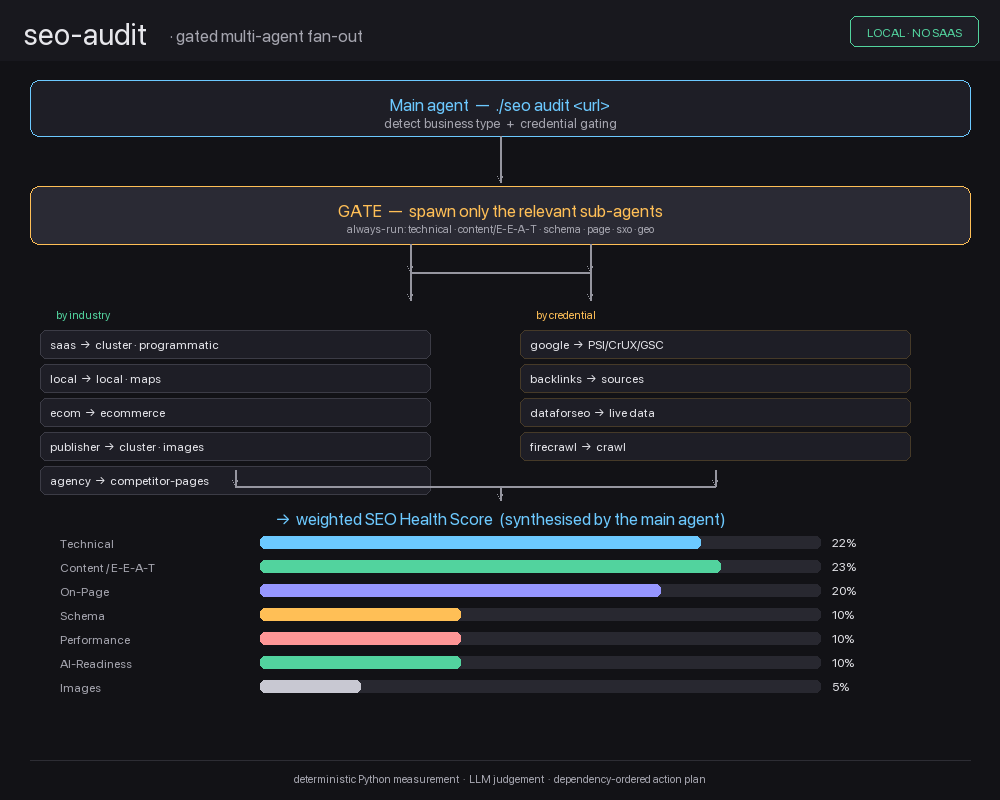

# seo-audit — Local SEO & Technical Audit Toolkit

[English](README.md) | [简体中文](README.zh.md)


[](https://github.com/Haniubub/seo-toolkit/actions)

> **Status:** production-ready · **v1.0.0**


A production-grade SEO audit toolkit that runs a full, weighted technical, content,
schema and local audit on any website — **self-contained and strictly local**: no Claude
Code, no plugin marketplace, no third-party SaaS, no per-domain pricing. It executes as a
plain CLI + agent library in the DeepSeek Harness environment and works out of the box.

Built for **local SEO**, **technical SEO**, **schema.org**, **E-E-A-T**, **GEO / AI Overviews**,
**Google Business Profile (GBP)**, **on-page & content** audits across any industry.

It combines **deterministic measurement** (own Python specialists + 53 curated
scripts) with **LLM-driven judgment** (24 sub-skills + 18 specialist agents), and
synthesises everything into one weighted, prioritised report.

The audit logic is anchored in primary-source Google guidance and this is a native,
self-contained port of the MIT toolkit
[AgriciDaniel/claude-seo](https://github.com/AgriciDaniel/claude-seo) v2.2.5 —
see [Attribution & License](#attribution--license).

<p align="center">
  
</p>

---

## Table of Contents

- [What it does](#what-it-does)
- [Example output](#example-output)
- [How it compares](#how-it-compares)
- [Cost per audit — DeepSeek Harness vs Claude Code](#cost-per-audit--deepseek-harness-vs-claude-code)
- [Quick start (Gated multi-agent fan-out)](#quick-start)
- [Architecture](#architecture)
- [Requirements](#requirements)
- [Key-gated features](#key-gated-features)
- [Security & credentials](#security--credentials)
- [Sources & References](#sources--references)
- [Attribution & License](#attribution--license)

---

## What it does

A full audit is split into two layers:

| Layer | What it is | How it runs |
|-------|------------|-------------|
| **Measurement** | 5 Python specialists + 53 curated scripts | `./seo <command>` |
| **Judgment** | 24 sub-skills + 18 agent prompts (E-E-A-T, GEO/AIO, Local/GBP, SXO, …) | Agent executes via `subagent`/`workflow` |

Every recommendation carries the four claude-seo fields:
**Observation → Dependency → Failure signal → Early indicator.**

---

## Example output

A sample of the top recommendations an audit produces, with their four fields.
These are illustrative (anonymised, no real site data) — they show the shape of
the output, not a specific client's findings.

**① Complete the local structured data** (LocalBusiness / Restaurant)
- **Observation:** Structured data is missing or incomplete — NAP and opening hours are not exposed as JSON-LD.
- **Dependency:** first; local signals build on it.
- **Failure signal:** the Rich Results Test still reports no `LocalBusiness` markup.
- **Early indicator:** the business panel appears with correct hours and menu.

**② Fix a case-sensitive asset path** (stylesheet 404)
- **Observation:** a stylesheet is requested with the wrong casing and returns a 404, leaving the page unstyled.
- **Dependency:** immediately; purely technical, blocks nothing else.
- **Failure signal:** the page still loads without styles; the 404 persists.
- **Early indicator:** no 404 in the log; Core Web Vitals improve.

**③ Add crawlable fallback content + robots & sitemap**
- **Observation:** the page is client-rendered (SPA) — little content is reachable without JS support.
- **Dependency:** after schema; content must exist for the markup to apply.
- **Failure signal:** "rendered: no" persists; pages stay unindexed.
- **Early indicator:** crawlable visibility rises.

These three span different impact axes — local visibility, rendering/performance
and indexation — which is exactly why they surface near the top of an audit.
Full audit output is a weighted score across seven categories plus a
dependency-ordered action plan.

---

## How it compares

Most SEO automation on GitHub falls into a few buckets, and most cover only one
of them. This toolkit is the only one that combines all four:

| Capability | Single-feature tools | Claude-Code-only | Hobby projects | Agent frameworks | **seo-audit** |
|------------|:--:|:--:|:--:|:--:|:--:|
| Full audit (technical + content + schema + local) | — | ✅ | — | — | ✅ |
| Deterministic measurement layer (no LLM for the crawl) | — | — | — | — | ✅ |
| Weighted, Google-aligned scoring | — | — | — | — | ✅ |
| Gated multi-agent fan-out by business type | — | — | — | — | ✅ |
| Runs locally, no SaaS / no per-site pricing | — | — | — | — | ✅ |
| Secret redaction + sandbox hardening | — | — | — | — | ✅ |
| Drift tracking (baseline / compare / history) | — | — | — | — | ✅ |
| Pluggable extensions (DataForSEO, Firecrawl, Ahrefs, Bing) | — | — | — | — | ✅ |

The through-line: **measurement** is deterministic Python (repeatable, cheap),
**judgment** is LLM-backed, and the two are gated so you only run the agents a
site actually needs. That combination — plus primary-source Google guidance and
cost transparency — is what separates it from the single-feature and
Claude-locked alternatives.

---

## Cost per audit — DeepSeek Harness vs Claude Code

The judgment layer uses an LLM, so that part costs real tokens. But the
measurement layer is **pure local Python** (53 scripts + `lib/`) — it runs on
your machine for **$0 in LLM tokens**. Only the LLM reasoning over those findings
costs anything, and on DeepSeek that's a few cents per audit — the whole reason
this port is worth switching to.

> ### 💡 **12×–30× cheaper per audit** than running the same audit on Claude.
> Full comparison below — the number holds for every Claude tier you would
> otherwise run (Sonnet 5, Opus 5, even Haiku).

| Model (per 1M tokens — in / out) | Input | Output | **Cost per full audit** | **Cost × 50** | **Cost × 500** |
|---------------------------------|-------|--------|--------------------------|---------------|----------------|
| Claude Sonnet 5 (cheapest tier) | $2.00 | $10.00 | **≈ $0.45** | ≈ $22.50 | ≈ $225.00 |
| Claude Opus 5 (top tier) | $5.00 | $25.00 | **≈ $1.13** | ≈ $56.50 | ≈ $565.00 |
| **DeepSeek V3.2** | **$0.27** | **$0.40** | **≈ $0.04** | ≈ $2.00 | ≈ $18.50 |

The gap only widens at volume. At 500 audits Claude Opus would bill you
**≈ $565** for the LLM judgment — DeepSeek runs the same **≈ $18.50**.

**Worked example** — one full `./seo audit` on a local-service site spawns the
always-on agents (technical, content/E-E-A-T, schema, page, sxo, geo) plus a few
industry-specific ones, then synthesises the weighted report. Measure that as
**100,000 input tokens and 25,000 output tokens** per audit:

```
Claude Sonnet 5: (0.10 M × $2)   + (0.025 M × $10)   = $0.20 + $0.25 = $0.45
Claude Opus 5:   (0.10 M × $5)   + (0.025 M × $25)   = $0.50 + $0.625 = $1.13
DeepSeek V3.2:   (0.10 M × $0.27)+ (0.025 M × $0.40)  = $0.027 + $0.01 = $0.037
```

So the same audit costs **≈ $0.04 on DeepSeek** against **≈ $0.45–$1.13 on
Claude** (Sonnet 5 to Opus 5) — roughly **12×–30× cheaper**, depending on the
Claude tier you would otherwise run. At 20 sites a day Claude would bill you
**≈ $9.00–$22.60** for the LLM judgment alone; DeepSeek does the same for
**≈ $0.74**.

The measurement layer never touches the LLM, so a `technical`, `schema` or
`local` check costs **$0 in LLM tokens** — only the reasoning steps that need
judgement cost anything.

> Prices are indicative list rates as of August 2026 and change frequently.
> DeepSeek rates per [OpenRouter](https://openrouter.ai/deepseek); Claude rates
> per [Anthropic pricing](https://platform.claude.com/docs/en/about-claude/pricing).
> Token volumes are illustrative of a typical multi-agent audit and vary by site.

---

## Quick start

New here? See [docs/TUTORIAL.md](docs/TUTORIAL.md) — an end-to-end audit in 5 minutes.

```bash
cd seo-toolkit
./setup.sh          # installs workspace-local deps + Playwright Chromium
./seo doctor        # environment health check

./seo audit https://example.com        # full weighted audit
./seo technical <url>                   # technical SEO (9 categories)
./seo page <url>                        # on-page / content signals
./seo schema <url>                      # schema.org / LocalBusiness
./seo local <url>                       # local / NAP signals
./seo visual <url>                      # render, hydration, console errors
./seo sitemap <url>                     # sitemap discovery & validation
./seo content <url|file>                # QRG content-quality scoring
./seo backlinks <url>                   # free backlink sources
./seo cluster <keyword>                 # keyword clustering
./seo content-brief <topic> [keyword]   # content brief
./seo drift baseline|compare|history <url>
./seo google <sub> [args]               # PSI / CrUX / GSC / GA4 (key required)
./seo run <script.py> [args]            # run any of the 53 scripts directly
./seo list                              # enumerate scripts, skills, extensions
```

### Gated multi-agent fan-out

`./seo audit` detects the business type, then spawns only the **relevant**
sub-agents in parallel (never all 18):
- **Always:** technical, content/E-E-A-T, schema, page, sxo, geo
- **By industry:** saas → cluster/programmatic · local-service → local/maps
  · ecommerce → ecommerce · publisher → cluster/images · agency → competitor-pages
- **By credential:** google, backlinks, dataforseo, firecrawl (only with keys)

Ready-made workflow: `audit-fanout.workflow.js`.

---

## Architecture

```
seo-toolkit/
├── seo.py               # CLI orchestrator (weighted score, redaction, gating)
├── lib/                 # measurement core (fetch, report, drift, checks_*)
├── scripts/             # 53 ported measurement scripts
├── skills/              # 24 sub-skill prompt packs + reference knowledge
├── agents/              # 18 specialist agent prompts
├── extensions/          # DataForSEO, Firecrawl, Ahrefs, Bing, Banana, …
├── schema/ pdf/ data/   # support assets
└── audit-fanout.workflow.js  # reproducible parallel fan-out
```

**Weighted SEO Health Score** (claude-seo parity): Technical 22% · Content 23%
· On-Page 20% · Schema 10% · Performance 10% · AI-Readiness 10% · Images 5%.

**Sandbox-safe runtime:** workspace-local `pylibs/` (pinned to known-good
`lxml==5.4.0`, `requests==2.32.5`, `playwright==1.55.0`) and `browsers/`.

---

## Requirements

- Python 3.10+ on macOS/Linux
- `requests`, `beautifulsoup4`, `lxml`, `playwright` (see `requirements.txt`)

---

## Key-gated features

Google APIs (PageSpeed, CrUX, GSC, GA4), DataForSEO, Firecrawl, Ahrefs, Bing and
Banana are **ported but require their own credentials**. Without them the core
measurement still works fully.

## Security & credentials

Your API keys are read from **environment variables** at runtime
(`os.environ.get(...)`) — nothing is stored in the repo or in a config file that
gets committed. A few best practices:

- Use **scoped, temporary keys** for audits (a throwaway token or a limited-key
  credential with only the permissions you need).
- **Delete the key when you're done** — after the audit, revoke/remove it. Don't
  leave it sitting in your shell profile.
- Keys are redacted from any printed or saved output, but treat them as live
  secrets regardless: never paste a real key into a log, an issue, or a shared
  config.
- The core audit needs **no key at all** — credentials only unlock the optional
  Google/DataForSEO/Firecrawl/Ahrefs/Bing data.

---

## Sources & References

The audit logic and scoring are grounded in primary-source guidance rather than
blog-level folklore. The bundled [`pdf/google-seo-reference.md`](pdf/google-seo-reference.md)
is the canonical, curated source-of-truth shipped with this toolkit, and the
categories map to the following references.

### Google Search guidance

- [Google Search Essentials](https://developers.google.com/search/docs/essentials) — technical requirements, spam policies, key best practices
- [How Google Search Works](https://developers.google.com/search/docs/fundamentals/how-search-works)
- [Creating helpful, reliable, people-first content](https://developers.google.com/search/docs/fundamentals/creating-helpful-content) — E-E-A-T & the Search Quality Rater Guidelines (QRG)
- [Spam policies](https://developers.google.com/search/docs/essentials/spam-policies)
- [Google's AI Optimization Guide](https://developers.google.com/search/docs/fundamentals/ai-optimization-guide) — GEO / AI Overviews alignment
- [Google Search Central Blog](https://developers.google.com/search/blog) — algorithm & feature updates (FAQ rich results, deprecated types, site-reputation abuse)

### Structured data & Schema.org

- [Google Structured Data Overview](https://developers.google.com/search/docs/appearance/structured-data/intro-structured-data)
- [Rich Results Test](https://search.google.com/test/rich-results)
- [schema.org](https://schema.org) — active type vocabulary, plus the deprecated-types tracking

### Performance, field & lab data

- [Core Web Vitals](https://web.dev/articles/inp) — INP replaced FID (web.dev)
- [PageSpeed Insights](https://pagespeed.web.dev/) — lab + field data (CrUX)
- [Search Console Help](https://support.google.com/webmasters) — indexation & GSC

### Tooling

- Headless rendering via [Playwright](https://playwright.dev/) · HTML/text extraction from
  [trafilatura](https://github.com/adbar/trafilatura) & [htmldate](https://github.com/adbar/htmldate)
- PDF reports via [WeasyPrint](https://weasyprint.org/)

### Upstream

- [AgriciDaniel/claude-seo](https://github.com/AgriciDaniel/claude-seo) v2.2.5 — the MIT
  toolkit this is a native port of (see [Attribution & License](#attribution--license))

> The bundled references and this list stay aligned with Google Search currency
> through August 2026. Deprecated structured-data types (HowTo,
> SpecialAnnouncement, ClaimReview, VehicleListing, …) are flagged rather than
> recommended.

---

## Attribution & License

This project is a **native re-implementation and port** of
[AgriciDaniel/claude-seo](https://github.com/AgriciDaniel/claude-seo) v2.2.5
(MIT, © Agrici Daniel). It does **not** vendor the original repository or run
Claude Code; the upstream toolkit was ported, adapted and rebuilt to run
standalone as a local CLI + agent library in the DeepSeek Harness environment.

Where the measurement logic is derived from claude-seo, the original MIT
copyright and permission notice is preserved in [`LICENSE`](LICENSE) and in the
individual ported script headers.

**This repo's own work** (also MIT, © 2026 seo-audit contributors):

- **Runtime port & integration** — a wrapper/orchestrator that executes the
  toolkit natively as `./seo`, with dependency pinning and a sandbox-safe,
  workspace-local runtime (no global installs, no SaaS).
- **Weighted health scoring** — the 22/23/20/10/10/10/5 category weighting and
  the `overall_score()` renormalisation.
- **Gated multi-agent fan-out** — business-type detection + credential gating so
  only relevant sub-agents spawn, with the reproducible `audit-fanout.workflow.js`.
- **Toolchain hardening** — Playwright headless-render worker with hard subprocess
  timeouts, redaction of secrets, `lib/` measurement core, and curated script set.
- **Packaging, docs & CI** — README, architecture, `./seo doctor`, GitHub Actions
  CI, `CHANGELOG.txt`/release notes.

Both the upstream-derived and the original code are released under the
[MIT License](LICENSE).
