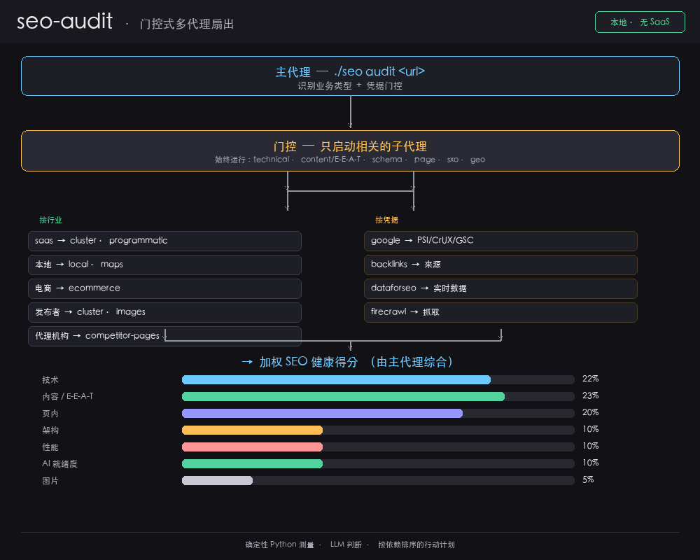

# seo-audit — 面向 DeepSeek Harness (DSH) 的 SEO 审计工具包

[English](README.md) | [简体中文](README.zh.md)


[](https://github.com/Haniubub/seo-toolkit/actions)

> **状态：** 生产可用 · **v1.0.0**

**面向 DeepSeek Harness (DSH) 的原生 SEO 审计工具包**，可对任意网站执行完整、加权的技术、内容、schema 与本地审计 —— **完全自包含且严格本地运行**：无需 Claude Code、无需插件市场、无需第三方 SaaS、无需按域名付费，**核心审计也无需 API Key**。它以普通 CLI + 代理库的形式在 DeepSeek Harness 环境中运行，开箱即用。

与绑定 Claude Code 的 SEO 技能不同，seo-audit **原生属于 DSH**：直接在您已在使用的 Harness 中运行，数据不离开您的机器。

专为 **本地 SEO**、**技术 SEO**、**schema.org**、**E-E-A-T**、**GEO / AI Overviews**、**Google Business Profile (GBP)**、**页内与内容** 审计而构建，适用于任何行业。

它将**确定性测量**（自研 Python 专家 + 53 个精选脚本）与 **LLM 驱动的判断**（24 个子技能 + 18 个专家代理）相结合，并把所有结果综合成一份加权的、按优先级排序的报告。

审计逻辑以 Google 官方一手资料为依据。本项目是 [AgriciDaniel/claude-seo](https://github.com/AgriciDaniel/claude-seo) v2.2.5 的一个原生、自包含移植 —— 参见 [署名与许可](#署名与许可)。

<p align="center">
  
</p>

---

## 目录

- [它能做什么](#它能做什么)
- [输出示例](#输出示例)
- [对比优势](#对比优势)
- [单次审计成本 — DeepSeek Harness vs Claude Code](#单次审计成本--deepseek-harness-vs-claude-code)
- [快速开始（门控式多代理扇出）](#快速开始门控式多代理扇出)
- [架构](#架构)
- [运行要求](#运行要求)
- [需要密钥的功能](#需要密钥的功能)
- [安全与凭据](#安全与凭据)
- [参考来源](#参考来源)
- [署名与许可](#署名与许可)

---

## 它能做什么

一次完整审计分为两层：

| 层 | 是什么 | 如何运行 |
|-------|------------|-------------|
| **测量** | 5 个 Python 专家 + 53 个精选脚本 | `./seo <command>` |
| **判断** | 24 个子技能 + 18 个代理提示词（E-E-A-T、GEO/AIO、Local/GBP、SXO 等） | 代理通过 `subagent`/`workflow` 执行 |

每条建议都带四个字段：
**观察 → 依赖 → 失败信号 → 早期指标。**

---

## 输出示例

审计产生的最佳建议示例，附带其四个字段。以下内容为示意（已匿名，不含真实网站数据）—— 它展示的是输出的*形式*，而非某个具体客户的结论。

**① 补全本地结构化数据**（LocalBusiness / 餐厅）
- **观察：** 结构化数据缺失或不完整 —— NAP 与营业时间未以 JSON-LD 形式暴露。
- **依赖：** 优先；本地信号建立在它之上。
- **失败信号：** Rich Results Test 仍显示没有 `LocalBusiness` 标记。
- **早期指标：** 商家信息卡片以正确的营业时间与菜单出现。

**② 修复大小写敏感的资源路径**（样式表 404）
- **观察：** 样式表以错误的大小写被请求并返回 404，导致页面无样式。
- **依赖：** 立即；纯技术问题，不阻塞其他信号。
- **失败信号：** 页面仍无样式加载；404 持续存在。
- **早期指标：** 日志中无 404；Core Web Vitals 改善。

**③ 添加可抓取的备用内容 + robots 与 sitemap**
- **观察：** 页面为客户端渲染（SPA）—— 没有 JS 支持时，几乎无法访问内容。
- **依赖：** 位于 schema 之后；必须先有内容，标记才能生效。
- **失败信号：** “rendered: no” 持续；页面仍未被收录。
- **早期指标：** 可抓取可见性上升。

这三项覆盖不同影响维度 —— 本地可见性、渲染/性能与收录 —— 这正是它们排在审计前部的原因。完整审计输出是七类别的加权得分，外加一份按依赖排序的行动计划。

---

## 对比优势

GitHub 上绝大多数 SEO 自动化工具只属于以下某一类，且大多只覆盖其中一项。本工具包是唯一一个同时具备全部四项的：

| 能力 | 单功能工具 | 仅限 Claude Code | 业余项目 | 代理框架 | **seo-audit** |
|------------|:--:|:--:|:--:|:--:|:--:|
| 完整审计（技术 + 内容 + 架构 + 本地） | — | ✅ | — | — | ✅ |
| 确定性测量层（抓取不依赖 LLM） | — | — | — | — | ✅ |
| 加权的、对齐 Google 的评分 | — | — | — | — | ✅ |
| 按业务类型门控的多代理扇出 | — | — | — | — | ✅ |
| 本地运行，无 SaaS / 无按域名付费 | — | — | — | — | ✅ |
| 密钥脱敏 + 沙箱加固 | — | — | — | — | ✅ |
| 漂移追踪（基线 / 对比 / 历史） | — | — | — | — | ✅ |
| 可插拔扩展（DataForSEO、Firecrawl、Ahrefs、Bing） | — | — | — | — | ✅ |

主线在于：**测量**是可复现、低成本的确定性 Python；**判断**由 LLM 支撑；二者被门控，因此你只运行站点真正需要的代理。这一组合 —— 外加 Google 一手资料与成本透明度 —— 使它与单功能及 Claude 绑定的替代方案区分开来。

---

## 单次审计成本 — DeepSeek Harness vs Claude Code

判断层使用 LLM，因此这一部分确实消耗真实 token。但**测量层是纯本地 Python**（53 个脚本 + `lib/`）—— 它在你的机器上运行，**LLM token 成本为 $0**。唯一需要花费的是针对这些结果的 LLM 推理，而在 DeepSeek 上每次审计仅需几美分 —— 这正是值得迁移到这个移植版本的原因。

> ### 💡 **每次审计便宜 12×–30×**，相比于在 Claude 上运行同一审计。
> 完整对比见下 —— 该数字对任意 Claude 档位均成立（Sonnet 5、Opus 5，甚至 Haiku）。

| 模型（每 1M token — 输入 / 输出） | 输入 | 输出 | **单次完整审计成本** | **× 50** | **× 500** |
|---------------------------------|-------|--------|--------------------------|---------------|----------------|
| Claude Sonnet 5（最低档） | $2.00 | $10.00 | **≈ $0.45** | ≈ $22.50 | ≈ $225.00 |
| Claude Opus 5（最高档） | $5.00 | $25.00 | **≈ $1.13** | ≈ $56.50 | ≈ $565.00 |
| **DeepSeek V3.2** | **$0.27** | **$0.40** | **≈ $0.04** | ≈ $2.00 | ≈ $18.50 |

量越大差距越明显。500 次审计时 Claude Opus 会为 LLM 判断向你收取 **≈ $565** —— DeepSeek 运行同样操作只需 **≈ $18.50**。

**示例计算** —— 对本地服务网站执行一次完整 `./seo audit` 会启动常驻代理（technical、content/E-E-A-T、schema、page、sxo、geo）加上少量行业特定代理，然后综合出加权报告。按每次审计 **100,000 输入 token 与 25,000 输出 token** 来测算：

```
Claude Sonnet 5: (0.10 M × $2)   + (0.025 M × $10)   = $0.20 + $0.25 = $0.45
Claude Opus 5:   (0.10 M × $5)   + (0.025 M × $25)   = $0.50 + $0.625 = $1.13
DeepSeek V3.2:   (0.10 M × $0.27)+ (0.025 M × $0.40)  = $0.027 + $0.01 = $0.037
```

因此同一审计在 DeepSeek 上成本 **≈ $0.04**，而在 Claude 上为 **≈ $0.45–$1.13**（Sonnet 5 到 Opus 5）—— 大约便宜 **12×–30×**，具体取决于你本会在哪个 Claude 档位上运行。每天跑 20 个站点，Claude 仅为 LLM 判断就收取 **≈ $9.00–$22.60**；DeepSeek 完成同样工作只需 **≈ $0.74**。

测量层从不接触 LLM，因此 `technical`、`schema` 或 `local` 检查的 **LLM token 成本为 $0** —— 只有需要判断的推理步骤才产生费用。

> 价格为依据 2026 年 8 月的参考挂牌价，会频繁变动。
> DeepSeek 价格见 [OpenRouter](https://openrouter.ai/deepseek)；Claude 价格见 [Anthropic pricing](https://platform.claude.com/docs/en/about-claude/pricing)。
> token 用量为典型多代理审计的示意值，因站点而异。

---

## 快速开始（门控式多代理扇出）

第一次使用？请阅读 [docs/TUTORIAL.md](docs/TUTORIAL.md) —— 5 分钟端到端审计。

```bash
cd seo-toolkit
./setup.sh          # 安装工作区本地依赖 + Playwright Chromium
./seo doctor        # 环境健康检查

./seo audit https://example.com        # 完整加权审计
./seo technical <url>                   # 技术 SEO（9 类）
./seo page <url>                        # 页内 / 内容信号
./seo schema <url>                      # schema.org / LocalBusiness
./seo local <url>                       # 本地 / NAP 信号
./seo visual <url>                      # 渲染、水合、控制台错误
./seo sitemap <url>                     # sitemap 发现与校验
./seo content <url|file>                # QRG 内容质量评分
./seo backlinks <url>                   # 免费外链来源
./seo cluster <keyword>                 # 关键词聚类
./seo content-brief <topic> [keyword]   # 内容简报
./seo drift baseline|compare|history <url>
./seo google <sub> [args]               # PSI / CrUX / GSC / GA4（需密钥）
./seo run <script.py> [args]            # 直接运行 53 个脚本中的任意一个
./seo list                              # 枚举脚本、子技能、扩展
```

### 门控式多代理扇出

`./seo audit` 会识别业务类型，然后并行启动**相关**子代理（绝不启动全部 18 个）：
- **总是运行：** technical、content/E-E-A-T、schema、page、sxo、geo
- **按行业：** saas → cluster/programmatic · local-service → local/maps
  · ecommerce → ecommerce · publisher → cluster/images · agency → competitor-pages
- **按凭据：** google、backlinks、dataforseo、firecrawl（仅在有密钥时）

现成的工作流：`audit-fanout.workflow.js`。

---

## 架构

```
seo-toolkit/
├── seo.py               # CLI 编排器（加权评分、脱敏、门控）
├── lib/                 # 测量核心（fetch、report、drift、checks_*）
├── scripts/             # 53 个移植的测量脚本
├── skills/              # 24 个子技能提示词包 + 参考知识
├── agents/              # 18 个专家代理提示词
├── extensions/          # DataForSEO、Firecrawl、Ahrefs、Bing、Banana 等
├── schema/ pdf/ data/   # 支持资源
└── audit-fanout.workflow.js  # 可复现的并行扇出
```

**加权 SEO 健康得分**（与 claude-seo 对齐）：技术 22% · 内容 23% · 页内 20% · 架构 10% · 性能 10% · AI 就绪度 10% · 图片 5%。

**沙箱安全的运行时：** 工作区本地 `pylibs/`（固定到已知良好版本 `lxml==5.4.0`、`requests==2.32.5`、`playwright==1.55.0`）与 `browsers/`。

---

## 运行要求

- macOS/Linux 上的 Python 3.10+
- `requests`、`beautifulsoup4`、`lxml`、`playwright`（见 `requirements.txt`）

---

## 需要密钥的功能

Google API（PageSpeed、CrUX、GSC、GA4）、DataForSEO、Firecrawl、Ahrefs、Bing 与 Banana **已移植，但需要各自的凭据**。没有它们，核心测量仍可完整运行。

## 安全与凭据

你的 API 密钥在运行时通过**环境变量**读取（`os.environ.get(...)`）—— 不会存储到仓库或任何会被提交的配置文件中。几条最佳实践：

- 审计时使用**受限的临时密钥**（一次性令牌，或仅含所需权限的受限凭据）。
- **用完即删密钥** —— 审计结束后撤销/移除，不要让它留在 shell 配置中。
- 密钥会从任何打印或保存的输出中脱敏，但仍应将其视为活跃机密：切勿把真实密钥贴入日志、issue 或共享配置。
- 核心审计**完全不需要密钥** —— 凭据只解锁可选的 Google/DataForSEO/Firecrawl/Ahrefs/Bing 数据。

---

## 参考来源

审计逻辑与评分以一手资料为依据，而非博客层面的传言。随附的 [`pdf/google-seo-reference.md`](pdf/google-seo-reference.md) 是本工具包附带的权威、精选信息来源，各分类对应以下参考。

### Google 搜索指南

- [Google Search Essentials](https://developers.google.com/search/docs/essentials) —— 技术要求、垃圾内容政策、关键最佳实践
- [How Google Search Works](https://developers.google.com/search/docs/fundamentals/how-search-works)
- [Creating helpful, reliable, people-first content](https://developers.google.com/search/docs/fundamentals/creating-helpful-content) —— E-E-A-T 与搜索质量评估指南（QRG）
- [Spam policies](https://developers.google.com/search/docs/essentials/spam-policies)
- [Google's AI Optimization Guide](https://developers.google.com/search/docs/fundamentals/ai-optimization-guide) —— GEO / AI Overviews 对齐
- [Google Search Central Blog](https://developers.google.com/search/blog) —— 算法与功能更新（FAQ 富结果、废弃类型、站点信誉滥用）

### 结构化数据与 Schema.org

- [Google Structured Data Overview](https://developers.google.com/search/docs/appearance/structured-data/intro-structured-data)
- [Rich Results Test](https://search.google.com/test/rich-results)
- [schema.org](https://schema.org) —— 活跃类型词汇，以及废弃类型追踪

### 性能、现场与实验室数据

- [Core Web Vitals](https://web.dev/articles/inp) —— INP 取代 FID（web.dev）
- [PageSpeed Insights](https://pagespeed.web.dev/) —— 实验室 + 现场数据（CrUX）
- [Search Console Help](https://support.google.com/webmasters) —— 收录与 GSC

### 工具

- 通过 [Playwright](https://playwright.dev/) 进行无头渲染 · 使用 [trafilatura](https://github.com/adbar/trafilatura) 与 [htmldate](https://github.com/adbar/htmldate) 做 HTML/文本提取
- 通过 [WeasyPrint](https://weasyprint.org/) 生成 PDF 报告

### 上游

- [AgriciDaniel/claude-seo](https://github.com/AgriciDaniel/claude-seo) v2.2.5 —— 本项目原生移植的 MIT 工具包（见 [署名与许可](#署名与许可)）

> 随附的参考与本列表在 2026 年 8 月前与 Google 搜索的时效性保持一致。已废弃的结构化数据类型（HowTo、SpecialAnnouncement、ClaimReview、VehicleListing 等）会被标记而非推荐。

---

## 署名与许可

本项目是 [AgriciDaniel/claude-seo](https://github.com/AgriciDaniel/claude-seo) v2.2.5（MIT，© Agrici Daniel）的**原生重实现与移植**。它**不**打包原始仓库，也不运行 Claude Code；上游工具包被移植、改造并重建，以便在 DeepSeek Harness 环境中以本地 CLI + 代理库的形式独立运行。

凡测量逻辑源自 claude-seo 之处，其原始 MIT 版权与许可声明均保留在 [`LICENSE`](LICENSE) 及各移植脚本的文件头中。

**本仓库自身的工作**（同样为 MIT，© 2026 seo-audit 贡献者）：

- **运行时移植与集成** —— 一个以 `./seo` 原生执行该工具包的封装/编排器，含依赖固定与沙箱安全、工作区本地的运行时（无需全局安装、无 SaaS）。
- **加权健康评分** —— 22/23/20/10/10/10/5 的类别权重与 `overall_score()` 重归一化。
- **门控式多代理扇出** —— 业务类型检测 + 凭据门控，因此只启动相关子代理，并带有可复现的 `audit-fanout.workflow.js`。
- **工具链加固** —— 带严格子进程超时的 Playwright 无头渲染工作器、敏感信息脱敏、`lib/` 测量核心与精选脚本集。
- **打包、文档与 CI** —— README、架构、`./seo doctor`、GitHub Actions CI、`CHANGELOG.txt`/发布说明。

上游衍生代码与原代码均以 [MIT License](LICENSE) 发布。
